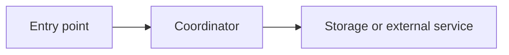
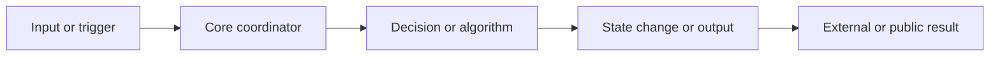
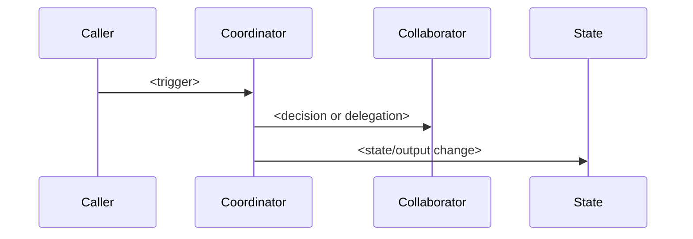
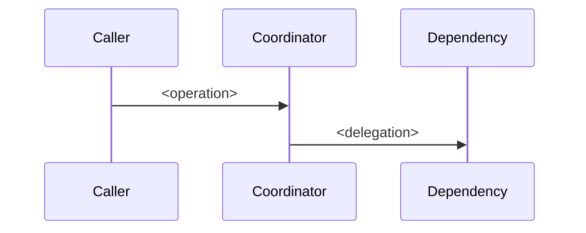

# DeepWiki-Style Page Templates

Use these templates when generating multi-page project documentation. Adapt headings to the repository; keep the evidence and scope sections.

## Canonical Wiki Structure

Use this as the default top-level module set. Keep module names and order stable across projects; adapt project-specific details in page content and child pages. Mark truly missing modules as `N/A` in the coverage matrix instead of creating filler prose.

Root files:

- `README.md`
- `coverage-matrix.md`
- `source-map.md`
- `glossary.md`
- `.wiki-manifest.json`

Top-level modules:

1. `01-system-architecture/README.md`
2. `02-entrypoints-runtime/README.md`
3. `03-core-implementation/README.md`
4. `04-interfaces-integrations/README.md`
5. `05-data-state-persistence/README.md`
6. `06-configuration-extension-security/README.md`
7. `07-operations-observability/README.md`
8. `08-testing-build-release/README.md`

## Wiki Index Template

```markdown
# <Project> Codebase Wiki

Generated by `generate-codebase-wiki` from commit `<hash>` on <YYYY-MM-DD>. Worktree: <clean/dirty>.
Managed files are tracked in `.wiki-manifest.json` for safe overwrite updates.

## Coverage Summary

| Canonical module | Current coverage | Priority | Primary evidence |
| --- | --- | --- | --- |
| System architecture | Covered / Partial / Gap / N/A | P0/P1/P2/N/A | `<path>:line-line` |
| Entry points and lifecycle | Covered / Partial / Gap / N/A | P0/P1/P2/N/A | `<path>:line-line` |
| Core implementation | Covered / Partial / Gap / N/A | P0/P1/P2/N/A | `<path>:line-line` |
| Interfaces and integrations | Covered / Partial / Gap / N/A | P0/P1/P2/N/A | `<path>:line-line` |
| Data, state, and persistence | Covered / Partial / Gap / N/A | P0/P1/P2/N/A | `<path>:line-line` |
| Testing, build, and release | Covered / Partial / Gap / N/A | P0/P1/P2/N/A | `<path>:line-line` |

## Reading Path

1. [System Architecture](./01-system-architecture/README.md)
2. [Entry Points and Runtime Lifecycle](./02-entrypoints-runtime/README.md)
3. [Core Implementation](./03-core-implementation/README.md)
4. [Interfaces and Integrations](./04-interfaces-integrations/README.md)
5. [Testing, Build, and Release](./08-testing-build-release/README.md)
6. [Glossary](./glossary.md)

## Repository Shape

| Area | Path | Role | Evidence |
| --- | --- | --- | --- |
| <area> | `<path>` | <specific role> | `<path>:line-line` |

## Architecture Summary

<Short, cited summary. Include a diagram when there are multiple processes, services, packages, or deployment units.>

## Source Map

| Topic | Wiki page | Primary files | Related tests/docs |
| --- | --- | --- | --- |
| <topic> | `<page>` | `<path>` | `<test path>` |
```

## Coverage Matrix Template

```markdown
# Coverage Matrix

| Canonical module | Domain concept | Current coverage | Split recommendation | Source evidence | Test evidence | External reference evidence | Priority |
| --- | --- | --- | --- | --- | --- | --- | --- |
| `01-system-architecture` | `<architecture concept>` | Covered / Partial / Gap / N/A | Keep / Split / Merge / Monitor / N/A | `<path>:line-line` | `<test path>` / None found | `<docs path or external reference>` / None used | P0/P1/P2/N/A |
| `02-entrypoints-runtime` | `<entrypoint or lifecycle>` | Covered / Partial / Gap / N/A | Keep / Split / Merge / Monitor / N/A | `<path>:line-line` | `<test path>` / None found | `<docs path or external reference>` / None used | P0/P1/P2/N/A |
| `03-core-implementation` | `<domain workflow or mechanism>` | Covered / Partial / Gap / N/A | Keep / Split / Merge / Monitor / N/A | `<path>:line-line` | `<test path>` / None found | `<docs path or external reference>` / None used | P0/P1/P2/N/A |
| `04-interfaces-integrations` | `<interface or integration>` | Covered / Partial / Gap / N/A | Keep / Split / Merge / Monitor / N/A | `<path>:line-line` | `<test path>` / None found | `<docs path or external reference>` / None used | P0/P1/P2/N/A |
| `05-data-state-persistence` | `<state or storage concept>` | Covered / Partial / Gap / N/A | Keep / Split / Merge / Monitor / N/A | `<path>:line-line` | `<test path>` / None found | `<docs path or external reference>` / None used | P0/P1/P2/N/A |
| `06-configuration-extension-security` | `<config, extension, or security concept>` | Covered / Partial / Gap / N/A | Keep / Split / Merge / Monitor / N/A | `<path>:line-line` | `<test path>` / None found | `<docs path or external reference>` / None used | P0/P1/P2/N/A |
| `07-operations-observability` | `<operations or observability concept>` | Covered / Partial / Gap / N/A | Keep / Split / Merge / Monitor / N/A | `<path>:line-line` | `<test path>` / None found | `<docs path or external reference>` / None used | P0/P1/P2/N/A |
| `08-testing-build-release` | `<testing, build, or release concept>` | Covered / Partial / Gap / N/A | Keep / Split / Merge / Monitor / N/A | `<path>:line-line` | `<test path>` / None found | `<docs path or external reference>` / None used | P0/P1/P2/N/A |
```

Priority guide:

- `P0` - high-value maintainer concept with strong source evidence and missing or over-merged coverage.
- `P1` - important concept with enough evidence; split when the current page is overloaded or the user requested depth.
- `P2` - useful context but acceptable as a parent-page section.
- `N/A` - module or concept does not apply to this repository.

Split recommendation guide:

- `Split` - create a domain subpage and add matching rows in `coverage-matrix.md` and `source-map.md`.
- `Keep` - current page gives enough focused coverage.
- `Merge` - concept is not independent enough for its own page.
- `Monitor` - external docs or naming suggest a concept, but local evidence is not enough.
- `N/A` - not applicable.

## Parent Page Template

```markdown
# <Major Area>

## Relevant Source Files

- `<path>` - <why this file or artifact matters>
- `<path>` - <why this file matters>

## Related tests

- `<test path>` - <behavior covered>

## Existing docs

- `<docs path>` - <official or historical docs to read alongside this page>

## Purpose and Scope

<Orient the reader and list child pages. Keep implementation details in deep dives.>

## Subtopics

| Page | Responsibility | Primary evidence |
| --- | --- | --- |
| `<child page>` | <specific lifecycle or public concept> | `<path>:line-line` |

## Architecture Summary

<Short, cited summary plus diagram if multiple components interact.>

## Sources

- `<path>:line-line`
```

## Subsystem Page Template

````markdown
# <Subsystem>

## Relevant Source Files

- `<path>` - <why this file or artifact matters>
- `<path>` - <why this file matters>
- `<test path>` - <behavior covered>

## Related tests

- `<test path>` - <behavior covered>

## Existing docs

- `<docs path>` - <official or historical docs to read alongside this page>

## Purpose and Scope

<What this page explains. Name adjacent topics that are intentionally out of scope.>

## Architecture

<Explain the main components and boundaries. Cite files near claims.>



## Key Types and Responsibilities

| Type / Module | Path | Responsibility | Evidence |
| --- | --- | --- | --- |
| `<symbol>` | `<path>` | <specific behavior> | `<path>:line-line` |

## Lifecycle / Data Flow

1. <Step with source citation>
2. <Step with source citation>
3. <Step with source citation>

## Configuration and Extension Points

| Setting / API / Hook | Defined in | Used by | Notes |
| --- | --- | --- | --- |
| `<name>` | `<path>:line` | `<path>:line` | <constraints> |

## Testing and Validation

| Behavior | Test / Automation | Evidence |
| --- | --- | --- |
| <behavior> | `<test path>` | `<path>:line-line` |

## Operational Notes and Risks

- <Known failure mode, migration concern, performance limit, or open question with citation.>

## Sources

- `<path>:line-line`
- `<path>:line-line`
````

## Core Implementation Parent Template

Use this for the adaptive heart of the wiki. Child pages should be named after real workflows or mechanisms from the project, not generic framework layers.

````markdown
# Core Implementation

## Relevant Source Files

- `<path>` - <central coordinator, algorithm, domain module, or runtime component>
- `<path>` - <state owner, contract, adapter, or collaborator>

## Related tests

- `<test path>` - <behavior covered>

## Existing docs

- `<docs path>` - <official or historical docs to read alongside this page>

## Purpose and Scope

<Explain what "core" means for this repository and what is intentionally out of scope.>

## Core Implementation Map

| Workflow / Mechanism | Page | Trigger / Input | Main coordinator | State / Output | Primary evidence |
| --- | --- | --- | --- | --- | --- |
| `<name>` | `<child page>` | `<input>` | `<symbol/path>` | `<state/output>` | `<path>:line-line` |

## End-to-End Flow



## Cross-Cutting Rules

- <Domain invariant, ordering rule, concurrency rule, compatibility constraint, or failure behavior with citation.>

## Sources

- `<path>:line-line`
````

## Core Mechanism Page Template

Use this for one detailed workflow, algorithm, state transition, orchestration path, rendering path, compilation pass, synchronization path, protocol handler, or domain rule set.

````markdown
# <Core Workflow or Mechanism>

## Relevant Source Files

- `<path>` - <entry, coordinator, or algorithm>
- `<path>` - <state owner, dependency, or integration boundary>

## Related tests

- `<test path>` - <behavior covered, or `None found`>

## Existing docs

- `<docs path>` - <docs to cross-link, or `None found`>

## Purpose and Scope

<One behavior only. Link back to Core Implementation and name adjacent topics that are out of scope.>

## Trigger and Inputs

| Input / Trigger | Source | Normalization / Validation | Evidence |
| --- | --- | --- | --- |
| `<input>` | `<path>:line-line` | `<rule>` | `<path>:line-line` |

## Execution Flow



## Source Walkthrough

1. <Step with citation>
2. <Step with citation>
3. <Step with citation>

## State, Decisions, and Failure Behavior

| Concern | Implementation | Evidence |
| --- | --- | --- |
| State transition / output | `<specific behavior>` | `<path>:line-line` |
| Branching rule | `<specific behavior>` | `<path>:line-line` |
| Error / fallback path | `<specific behavior>` | `<path>:line-line` |

## Contracts and Extension Points

| Contract | Defined in | Called by | Notes |
| --- | --- | --- | --- |
| `<symbol>` | `<path>:line-line` | `<path>:line-line` | <constraints> |

## Sources

- `<path>:line-line`
````

## Deep-Dive Page Template

Use this for child pages that explain one mechanism, lifecycle, protocol, extension point, or storage path.

````markdown
# <Mechanism>

## Relevant Source Files

- `<path>` - <definition site>
- `<path>` - <caller or integration point>

## Related tests

- `<test path>` - <behavior covered, or `None found`>

## Existing docs

- `<docs path>` - <docs to cross-link, or `None found`>

## Purpose and Scope

<One mechanism only. Link back to the parent page.>

## Control Flow



## Source Walkthrough

1. <Step with citation>
2. <Step with citation>
3. <Step with citation>

## Contracts and Extension Points

| Contract | Defined in | Called by | Notes |
| --- | --- | --- | --- |
| `<symbol>` | `<path>:line-line` | `<path>:line-line` | <constraints> |

## Sources

- `<path>:line-line`
````

## Glossary Template

```markdown
# Glossary

| Term | Meaning | Source |
| --- | --- | --- |
| `<term>` | <project-specific meaning> | `<path>:line-line` |
```

## Citation Rules

- Prefer `path:line-line` for local docs.
- Use exact-commit GitHub permalinks when docs will be read outside the local checkout and the snapshot has a GitHub remote plus commit.
- Cite the definition site for terms and the call site for behavior.
- If a claim spans multiple files, cite the narrowest set of files that proves the relationship.
- For generated diagrams, cite the source files immediately before or after the diagram.

## Planning Heuristics

- Derive page count from the concept inventory, not from technology assumptions.
- Start with 8-25 pages for medium repositories.
- For large mature repositories, use 10-20 parent pages plus 30-70 child pages when the codebase has enough distinct concepts.
- Keep the Canonical Wiki Structure visible in the index and coverage matrix so different project wikis remain comparable.
- Preserve canonical top-level directory names unless the user explicitly asks for a different convention.
- Run a Domain Coverage Audit after the first canonical draft; use it to identify high-value domain concepts that were over-merged.
- Split Core Implementation and other modules into child pages only when the repository has enough source evidence plus supporting tests, configuration, lifecycle, state, error-handling, operations, examples, or documentation evidence.
- Fill a coverage matrix before writing prose and update it during the Domain Coverage Audit; it should record domain concept, current coverage, split recommendation, source evidence, test evidence, external reference evidence, and priority.
- Give major lifecycle boundaries their own pages: startup, user action or request handling, background work, synchronization, extension loading, deployment.
- Give public contracts their own pages: HTTP APIs, CLI commands, plugin APIs, events, schemas.
- Add subpages when one topic needs separate reader paths for user surface, runtime, state, integrations, tests, or operations.
- Do not create a page for a directory unless it has a coherent responsibility that can be proven from code.
- Omit coverage rows that do not exist in the repository; do not create filler pages to satisfy the template.
- Use DeepWiki, official docs, or external docs only to discover potential gaps and vocabulary. Do not copy their directory structure into the generated wiki.
