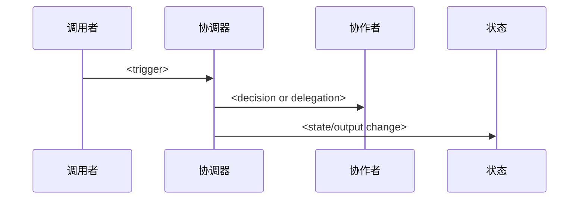
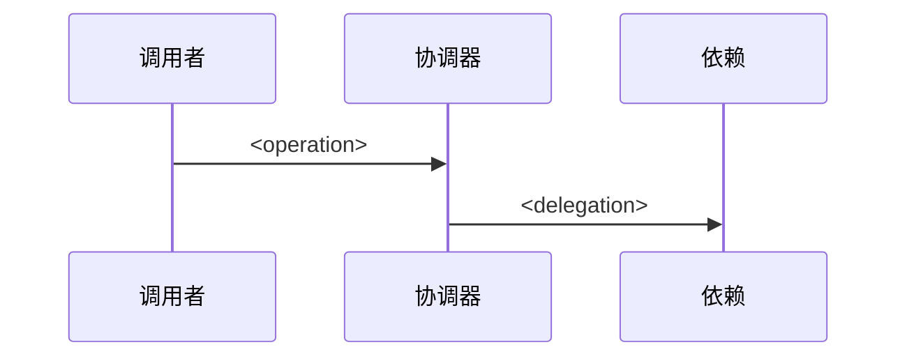

# DeepWiki 风格页面模板

在生成多页项目文档时使用这些模板。适配仓库的标题；保持证据和范围部分。

## 规范 Wiki 结构

使用此作为默认顶层模块集。跨项目保持模块名称和顺序稳定；在页面内容和子页面中适配项目特定细节。在 `README.md` 的覆盖摘要或内部覆盖规划表中将真正缺失的模块标记为 `N/A`，而不是创建填充内容。

根文件：

- `README.md`
- `.wiki-manifest.json`

默认不要创建 `coverage-matrix.md`、`source-map.md`、`glossary.md`。覆盖摘要、源码映射和必要术语说明应合并到 `README.md` 或相关模块页面中。

顶层模块：

1. `01-system-architecture/README.md`
2. `02-entrypoints-runtime/README.md`
3. `03-core-implementation/README.md`
4. `04-interfaces-integrations/README.md`
5. `05-data-state-persistence/README.md`
6. `06-configuration-extension-security/README.md`
7. `07-operations-observability/README.md`
8. `08-testing-build-release/README.md`

## Wiki 索引模板

```markdown
# <项目名称> 代码库 Wiki

由 `generate-codebase-wiki` 于 <YYYY-MM-DD> 从提交 `<hash>` 生成。工作树：<干净/脏>。
受管文件在 `.wiki-manifest.json` 中跟踪，用于安全的覆盖更新。

## 覆盖摘要

| 规范模块 | 当前覆盖 | 优先级 | 主要证据 |
| --- | --- | --- | --- |
| 系统架构 | 已覆盖 / 部分 / 缺口 / N/A | P0/P1/P2/N/A | `<path>:line-line` |
| 入口点与生命周期 | 已覆盖 / 部分 / 缺口 / N/A | P0/P1/P2/N/A | `<path>:line-line` |
| 核心实现 | 已覆盖 / 部分 / 缺口 / N/A | P0/P1/P2/N/A | `<path>:line-line` |
| 接口与集成 | 已覆盖 / 部分 / 缺口 / N/A | P0/P1/P2/N/A | `<path>:line-line` |
| 数据、状态与持久化 | 已覆盖 / 部分 / 缺口 / N/A | P0/P1/P2/N/A | `<path>:line-line` |
| 配置、扩展与安全 | 已覆盖 / 部分 / 缺口 / N/A | P0/P1/P2/N/A | `<path>:line-line` |
| 运维与可观测性 | 已覆盖 / 部分 / 缺口 / N/A | P0/P1/P2/N/A | `<path>:line-line` |
| 测试、构建与发布 | 已覆盖 / 部分 / 缺口 / N/A | P0/P1/P2/N/A | `<path>:line-line` |

## 阅读路径

1. [系统架构](./01-system-architecture/README.md)
2. [入口点与运行时生命周期](./02-entrypoints-runtime/README.md)
3. [核心实现](./03-core-implementation/README.md)
4. [接口与集成](./04-interfaces-integrations/README.md)
5. [数据、状态与持久化](./05-data-state-persistence/README.md)
6. [配置、扩展与安全](./06-configuration-extension-security/README.md)
7. [运维与可观测性](./07-operations-observability/README.md)
8. [测试、构建与发布](./08-testing-build-release/README.md)

## 仓库形态

| 区域 | 路径 | 角色 | 证据 |
| --- | --- | --- | --- |
| <区域> | `<path>` | <具体角色> | `<path>:line-line` |

## 架构摘要

<简短的、带引用的摘要。当存在多个进程、服务、包或部署单元时包含图表。>

## 源码映射

| 主题 | Wiki 页面 | 主要文件 | 相关测试/文档 |
| --- | --- | --- | --- |
| <主题> | `<page>` | `<path>` | `<test path>` |
```

## 内部覆盖规划表模板

```markdown
# 内部覆盖规划表

此表用于生成前规划和生成后审计；默认不要作为独立文件写入 `docs/wiki/`。需要对外呈现时，仅将高价值摘要合并进 `README.md` 的覆盖摘要或源码映射。

| 规范模块 | 领域概念 | 当前覆盖 | 拆分建议 | 源码证据 | 测试证据 | 外部参考证据 | 优先级 |
| --- | --- | --- | --- | --- | --- | --- | --- |
| `01-system-architecture` | `<架构概念>` | 已覆盖 / 部分 / 缺口 / N/A | 保持 / 拆分 / 合并 / 观察 / N/A | `<path>:line-line` | `<test path>` / 未找到 | `<docs path 或外部参考>` / 未使用 | P0/P1/P2/N/A |
| `02-entrypoints-runtime` | `<入口点或生命周期>` | 已覆盖 / 部分 / 缺口 / N/A | 保持 / 拆分 / 合并 / 观察 / N/A | `<path>:line-line` | `<test path>` / 未找到 | `<docs path 或外部参考>` / 未使用 | P0/P1/P2/N/A |
| `03-core-implementation` | `<领域工作流或机制>` | 已覆盖 / 部分 / 缺口 / N/A | 保持 / 拆分 / 合并 / 观察 / N/A | `<path>:line-line` | `<test path>` / 未找到 | `<docs path 或外部参考>` / 未使用 | P0/P1/P2/N/A |
| `04-interfaces-integrations` | `<接口或集成>` | 已覆盖 / 部分 / 缺口 / N/A | 保持 / 拆分 / 合并 / 观察 / N/A | `<path>:line-line` | `<test path>` / 未找到 | `<docs path 或外部参考>` / 未使用 | P0/P1/P2/N/A |
| `05-data-state-persistence` | `<状态或存储概念>` | 已覆盖 / 部分 / 缺口 / N/A | 保持 / 拆分 / 合并 / 观察 / N/A | `<path>:line-line` | `<test path>` / 未找到 | `<docs path 或外部参考>` / 未使用 | P0/P1/P2/N/A |
| `06-configuration-extension-security` | `<配置、扩展或安全概念>` | 已覆盖 / 部分 / 缺口 / N/A | 保持 / 拆分 / 合并 / 观察 / N/A | `<path>:line-line` | `<test path>` / 未找到 | `<docs path 或外部参考>` / 未使用 | P0/P1/P2/N/A |
| `07-operations-observability` | `<运维或可观测性概念>` | 已覆盖 / 部分 / 缺口 / N/A | 保持 / 拆分 / 合并 / 观察 / N/A | `<path>:line-line` | `<test path>` / 未找到 | `<docs path 或外部参考>` / 未使用 | P0/P1/P2/N/A |
| `08-testing-build-release` | `<测试、构建或发布概念>` | 已覆盖 / 部分 / 缺口 / N/A | 保持 / 拆分 / 合并 / 观察 / N/A | `<path>:line-line` | `<test path>` / 未找到 | `<docs path 或外部参考>` / 未使用 | P0/P1/P2/N/A |
```

优先级指南：

- `P0` - 具有高源码证据和缺失或过度合并覆盖的高价值维护者概念。
- `P1` - 有足够证据的重要概念；当当前页面超载或用户请求深度时拆分。
- `P2` - 有用的上下文，但作为父页面章节可以接受。
- `N/A` - 模块或概念不适用于此仓库。

拆分建议指南：

- `拆分` - 创建领域子页面并在 `README.md` 的覆盖摘要或源码映射中添加匹配行。
- `保持` - 当前页面给予足够聚焦的覆盖。
- `合并` - 概念不足以独立成页。
- `观察` - 外部文档或命名建议了概念，但本地证据不足。
- `N/A` - 不适用。

## 父页面模板

```markdown
# <主要区域>

## 相关源文件

- `<path>` - <此文件或产物为何重要>
- `<path>` - <此文件为何重要>

## 相关测试

- `<test path>` - <覆盖的行为>

## 现有文档

- `<docs path>` - <与此页面一起阅读的官方或历史文档>

## 目的与范围

<定位读者并列出子页面。将实现细节保留在深度分析中。>

## 子主题

| 页面 | 职责 | 主要证据 |
| --- | --- | --- |
| `<子页面>` | <具体生命周期或公共概念> | `<path>:line-line` |

## 架构摘要

<简短的、带引用的摘要，如果多个组件交互则包含图表。>

## 来源

- `<path>:line-line`
```

## 子系统页面模板

````markdown
# <子系统>

## 相关源文件

- `<path>` - <此文件或产物为何重要>
- `<path>` - <此文件为何重要>
- `<test path>` - <覆盖的行为>

## 相关测试

- `<test path>` - <覆盖的行为>

## 现有文档

- `<docs path>` - <与此页面一起阅读的官方或历史文档>

## 目的与范围

<此页面解释的内容。命名故意排除在范围之外的相邻主题。>

## 架构

<解释主要组件和边界。在声明附近引用文件。>


## 关键类型与职责

| 类型 / 模块 | 路径 | 职责 | 证据 |
| --- | --- | --- | --- |
| `<symbol>` | `<path>` | <具体行为> | `<path>:line-line` |

## 生命周期 / 数据流

1. <带源码引用的步骤>
2. <带源码引用的步骤>
3. <带源码引用的步骤>

## 配置与扩展点

| 设置 / API / 钩子 | 定义于 | 使用于 | 备注 |
| --- | --- | --- | --- |
| `<name>` | `<path>:line` | `<path>:line` | <约束> |

## 测试与验证

| 行为 | 测试 / 自动化 | 证据 |
| --- | --- | --- |
| <behavior> | `<test path>` | `<path>:line-line` |

## 运维注意事项与风险

- <已知故障模式、迁移问题、性能限制或带引用的待确认问题。>

## 来源

- `<path>:line-line`
- `<path>:line-line`
````

## 核心实现父页面模板

用于 Wiki 的适配核心。子页面应以项目中的真实工作流或机制命名，而不是通用的框架层。

````markdown
# 核心实现

## 相关源文件

- `<path>` - <中央协调器、算法、领域模块或运行时组件>
- `<path>` - <状态所有者、契约、适配器或协作者>

## 相关测试

- `<test path>` - <覆盖的行为>

## 现有文档

- `<docs path>` - <与此页面一起阅读的官方或历史文档>

## 目的与范围

<解释"核心"对此仓库意味着什么以及什么故意排除在范围之外。>

## 核心实现地图

| 工作流 / 机制 | 页面 | 触发器 / 输入 | 主要协调器 | 状态 / 输出 | 主要证据 |
| --- | --- | --- | --- | --- | --- |
| `<name>` | `<child page>` | `<input>` | `<symbol/path>` | `<state/output>` | `<path>:line-line` |

## 端到端流程


## 跨领域规则

- <带引用的领域不变量、排序规则、并发规则、兼容性约束或故障行为。>

## 来源

- `<path>:line-line`
````

## 核心机制页面模板

用于一个详细的工作流、算法、状态转换、编排路径、渲染路径、编译过程、同步路径、协议处理器或领域规则集。

````markdown
# <核心工作流或机制>

## 相关源文件

- `<path>` - <入口、协调器或算法>
- `<path>` - <状态所有者、依赖或集成边界>

## 相关测试

- `<test path>` - <覆盖的行为，或 `未找到`>

## 现有文档

- `<docs path>` - <交叉链接的文档，或 `未找到`>

## 目的与范围

<仅一个行为。链接回核心实现并命名故意排除在范围之外的相邻主题。>

## 触发器与输入

| 输入 / 触发器 | 来源 | 规范化 / 验证 | 证据 |
| --- | --- | --- | --- |
| `<input>` | `<path>:line-line` | `<rule>` | `<path>:line-line` |

## 执行流程



## 源码 walkthrough

1. <带引用的步骤>
2. <带引用的步骤>
3. <带引用的步骤>

## 状态、决策与故障行为

| 关注点 | 实现 | 证据 |
| --- | --- | --- |
| 状态转换 / 输出 | `<specific behavior>` | `<path>:line-line` |
| 分支规则 | `<specific behavior>` | `<path>:line-line` |
| 错误 / 回退路径 | `<specific behavior>` | `<path>:line-line` |

## 契约与扩展点

| 契约 | 定义于 | 调用者 | 备注 |
| --- | --- | --- | --- |
| `<symbol>` | `<path>:line-line` | `<path>:line-line` | <constraints> |

## 来源

- `<path>:line-line`
````

## 深度分析页面模板

用于解释一个机制、生命周期、协议、扩展点或存储路径的子页面。

````markdown
# <机制>

## 相关源文件

- `<path>` - <定义站点>
- `<path>` - <调用者或集成点>

## 相关测试

- `<test path>` - <覆盖的行为，或 `未找到`>

## 现有文档

- `<docs path>` - <交叉链接的文档，或 `未找到`>

## 目的与范围

<仅一个机制。链接回父页面。>

## 控制流



## 源码 walkthrough

1. <带引用的步骤>
2. <带引用的步骤>
3. <带引用的步骤>

## 契约与扩展点

| 契约 | 定义于 | 调用者 | 备注 |
| --- | --- | --- | --- |
| `<symbol>` | `<path>:line-line` | `<path>:line-line` | <constraints> |

## 来源

- `<path>:line-line`
````

## README 术语小节模板

```markdown
## 术语说明

| 术语 | 含义 | 来源 |
| --- | --- | --- |
| `<term>` | <项目特定含义> | `<path>:line-line` |
```

## 引用规则

- 本地文档优先使用 `path:line-line`。
- 当文档将在本地检出之外阅读且快照有 GitHub 远程和提交时使用精确提交的 GitHub 永久链接。
- 为术语引用定义站点，为行为引用调用站点。
- 如果一个声明跨越多个文件，引用证明关系的最窄文件集。
- 对于生成的图表，在图表前后立即引用源文件。

## 规划启发式

- 从概念清单推导页面数量，而不是从技术假设。
- 中型仓库从 8-25 个页面开始。
- 对于大型成熟仓库，当代码库有足够多的不同概念时使用 10-20 个父页面加 30-70 个子页面。
- 在 `README.md` 的覆盖摘要和源码映射中保持规范 Wiki 结构可见，以便不同项目的 Wiki 保持可比。
- 除非用户明确要求不同的约定，否则保留规范的顶层目录名。
- 在第一个规范草稿后运行领域覆盖审计；用它识别被过度合并的高价值领域概念。
- 仅当仓库有足够的源码证据加上支撑的测试、配置、生命周期、状态、错误处理、运维、示例或文档证据时，才将核心实现和其他模块拆分为子页面。
- 在编写散文之前填写内部覆盖规划表，并在领域覆盖审计期间更新它；它应记录领域概念、当前覆盖、拆分建议、源码证据、测试证据、外部参考证据和优先级。默认不要把该规划表作为独立 Markdown 文件输出。
- 给主要的生命周期边界自己的页面：启动、用户操作或请求处理、后台工作、同步、扩展加载、部署。
- 给公共契约自己的页面：HTTP API、CLI 命令、插件 API、事件、模式。
- 当一个主题需要用户界面、运行时、状态、集成、测试或运维的单独读者路径时添加子页面。
- 除非某个目录具有可从代码证明的连贯职责，否则不要为其创建页面。
- 省略仓库中不存在的覆盖行；不要创建填充页面来满足模板。
- 仅使用 DeepWiki、官方文档或外部文档来发现潜在缺口和词汇。不要将它们的目录结构复制到生成的 Wiki 中。
